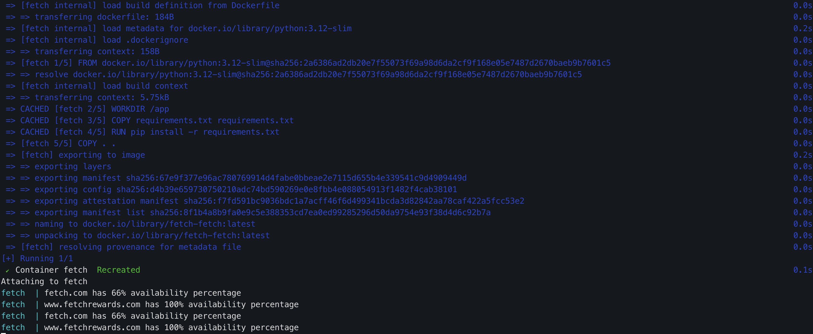

# Fetch

# Tech stack

- Docker
- Docker-compose
- Python

# Prerequisite
- Install Docker
  - [MacOS](https://docs.docker.com/desktop/setup/install/mac-install/)
  - [Windows](https://docs.docker.com/desktop/setup/install/windows-install/)

# Get started

- Run the app
    - `docker compose up --build`

# Clean up

- Shut down app
    - `docker compose down`

# Demo

